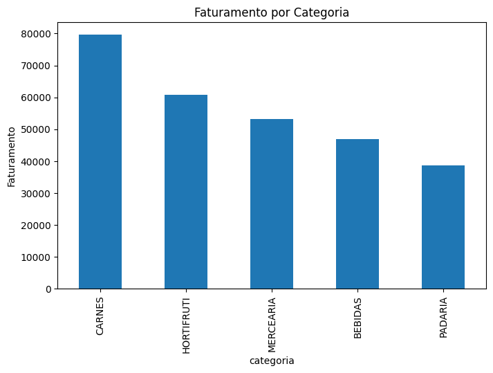
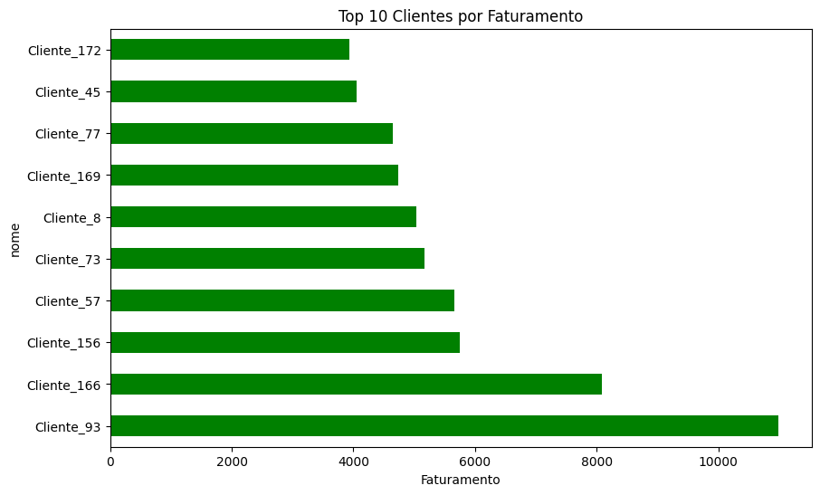
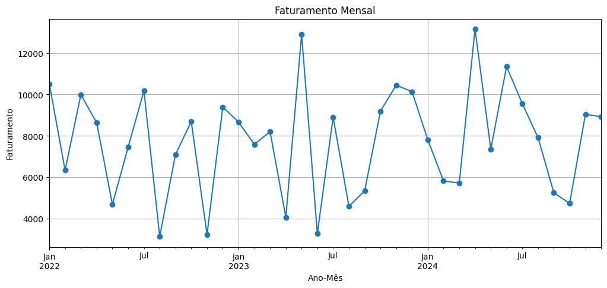

# Análise de Vendas, Clientes e Produtos

Este projeto realiza a análise de dados de vendas, clientes e produtos utilizando Python, com bibliotecas como **pandas, numpy, matplotlib e seaborn**.  
O objetivo é entender o faturamento por categoria, identificar os principais clientes e visualizar tendências mensais, permitindo insights estratégicos para o negócio.

---

## Estrutura do Projeto

- data/ : Arquivos CSV contendo os dados brutos  
- notebooks/ : Notebook com a análise completa  
- figures/ : Gráficos exportados do notebook  
- scripts/ : Funções de limpeza ou automação (opcional)  
- requirements.txt : Dependências do projeto  
- README.md : Este arquivo  

---

## Sobre os Dados

### Clientes (clientes.csv)

| Coluna        | Descrição |
|---------------|-----------|
| id_cliente    | Identificador único do cliente |
| nome          | Nome do cliente |
| idade         | Idade do cliente |
| cidade        | Cidade do cliente |
| estado        | Estado do cliente |

**Exemplo:**

| id_cliente | nome       | idade | cidade        | estado |
|------------|-----------|-------|---------------|--------|
| 1          | João Silva| 32    | São Paulo     | SP     |
| 2          | Maria Luz | 28    | Rio de Janeiro| RJ     |

---

### Produtos (produtos.csv)

| Coluna        | Descrição |
|---------------|-----------|
| id_produto    | Identificador único do produto |
| nome_produto  | Nome do produto |
| categoria     | Categoria do produto (MERCEARIA, PADARIA, etc) |
| preco_unitario| Preço unitário do produto |

---

### Vendas (vendas_com_data.csv)

| Coluna        | Descrição |
|---------------|-----------|
| id_venda      | Identificador único da venda |
| id_cliente    | Referência ao cliente |
| id_produto    | Referência ao produto |
| quantidade    | Quantidade vendida |
| data_venda    | Data da venda |

---

## Funcionalidades

- Limpeza e padronização dos dados  
- Cálculo de faturamento por venda  
- Análise de faturamento por categoria  
- Top 10 clientes por faturamento  
- Evolução do faturamento por mês  
- Visualização gráfica de insights  

---

## Principais Descobertas

- A categoria **MERCEARIA** concentra a maior parte do faturamento.  
- Poucos clientes representam uma grande fatia da receita.  
- A análise temporal mostra picos de vendas em meses específicos, possivelmente devido a promoções ou sazonalidade.  

  
*Figura: Faturamento agregado por categoria de produto*

  
*Figura: Top 10 clientes por faturamento*

  
*Figura: Evolução do faturamento por mês*

---

## Tecnologias e Bibliotecas

- Python  
- pandas, numpy  
- matplotlib, seaborn  

---

## Como Usar

Clone o repositório, instale dependências e abra o notebook:

```bash
git clone https://github.com/brunojlf-dev/analise-vendas-clientes-produtos.git
cd analise-vendas-clientes-produtos
pip install -r requirements.txt
# Abra o notebook no Jupyter ou Colab
notebooks/analise_vendas_clientes_produtos.ipynb
```
---

## Contato

- Autor: Bruno José Lucas Ferreira  
- GitHub: [brunojlf-dev](https://github.com/brunojlf-dev)

